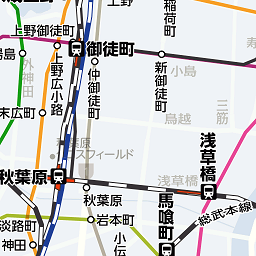
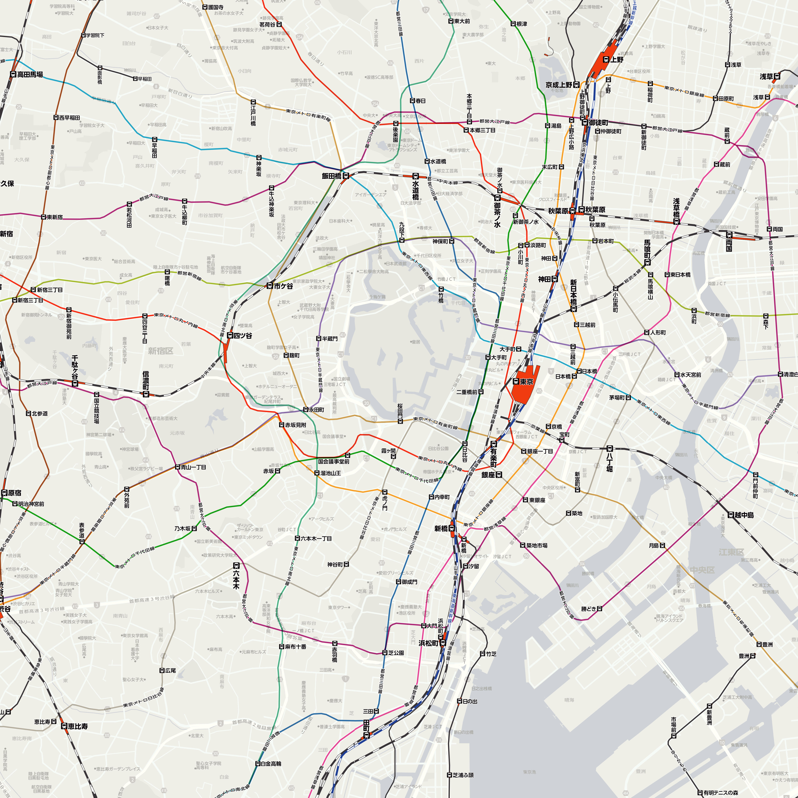
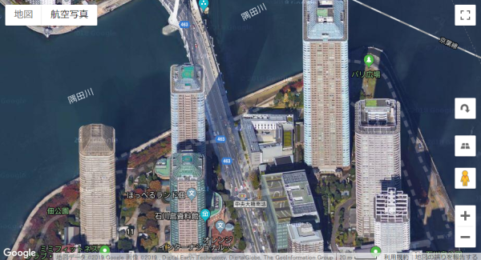
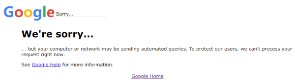
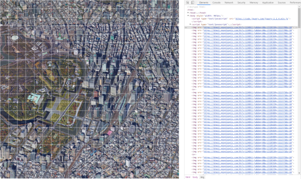

# Map Spider

寒假时，在电脑和手机上看地图时，遇到了一些问题:

* 网络加载速度很影响体验
* 将地图缩小时无法查看细节，放大后又无法看到整体

就想到可以设法把地图做成图片，保存在电脑或手机上，这样离线也可以查看了。

首先尝试制作的是雅虎地图。在雅虎地图的网站上查看网络传输内容可以看到地图是由一系列图像块组成的，每个图像块均有下面这样的URL:

```
https://map.c.yimg.jp/m?x=7276&y=870&z=14&r=1&style=base:railway&size=512
```

其中重要的参数是x、y和z。x、y分别表示东西方向、南北方向的位置; z表示缩放级别。现有的电子地图均设置了十余个缩放级别，z编号越大，地图的细节也越多。地图的提供者需要为此分别制作十余份不同尺度的地图，而不是简单地做一张精细的地图再缩小至其他分辨率。下图展示了一个图像块的例子，可见，地图上的文字都是预先放置在图像上的。



URL是规则的，于是，我们只需要写两层循环枚举x、y的值就可以把这些图像块下载下来了。代码(node.js)很简单:

```javascript
var express = require('express');
var fs = require('fs');
var request = require('request');
var http = require('http');
var https = require('https');
var app = express();
function downloadImage(url, filename) {
	https.get(url, function(req, res) {
		var imgData = '';
		req.setEncoding('binary');
		req.on('data', function(chunk) {
			imgData += chunk;
		});
		req.on('end', function() {
			fs.writeFileSync(filename, imgData, 'binary');
			console.log(filename);
		});
	});	
}
var xs = [58193, 58223];
var ys = [6945, 6975];
var level = 17;
for (var x = xs[0]; x <= xs[1]; x++) {
	for (var y = ys[0]; y <= ys[1]; y++) {
		var url = `https://map.c.yimg.jp/m?x=${x}&y=${y}&z=${level}&r=1&style=base:railway&size=512`;
		var filename = `images/yahoo/${level}/${x}_${y}.png`;
		if (!fs.existsSync(filename)) {
			downloadImage(url, filename);
		}
	}
}
```

再写一个简单的代码(python)把下载下来的图像拼接到一起:

```python
from PIL import Image
center = [58208, 6960]
radius = 15
level = 17
x = range(center[0] - radius, center[0] + radius + 1)
y = range(center[1] - radius, center[1] + radius + 1)
size = 512
w = size * (radius * 2 + 1)
h = size * (radius * 2 + 1)

img = Image.new('RGB', (w, h))

for i in x:
	for j in y:
		filename = 'images/yahoo/' + str(level) + '/' + str(i) + '_' + str(j) + '.png'
		print(filename)
		block = Image.open(filename)
		img.paste(block, box=(size * (i - x[0]), size * (y[-1] - j)))

savename = 'result' + '/' + str(level) + '_' + str(center[0]) + '_' + str(center[1]) + '_' + str(radius) + '.png'
img.save(savename)
print('Saved to ' + savename)
```

最后效果差不多是这样的:



就这样，yahoo地图被离线保存下来了。

***

最近看到谷歌地图提供的航拍特别棒，于是也想做一个离线版。众所周知，谷歌在国内无法访问，使用工具的话访问速度也很慢。谷歌地图的卫星/航拍模式还偏偏只能显示立体的地图，包含每个建筑的三维模型及贴图，需要加载大量的数据，访问极慢。好看是好看，但实在没必要为此牺牲加载时间。下图是三维地图的截图，图中每个建筑都是立体的，在国内的网络环境下全部加载完需要五分钟以上:


不过我在其他网站上找到了谷歌航拍地图的静态版，和上图差不多，但这幅图是完全静态的，不包含三维信息，加载也快了一些:



这个地图中的图像块的URL是这样的:

```
https://khms1.googleapis.com/kh?v=124&hl=ja&deg=0&x=232843&y=111380&z=18
```

这个URL也是规律的，包含x、y、z参数。斜向的航拍地图仅提供18、19这两个缩放级别。

但是，使用相同的代码爬取谷歌的地图失败了。。。。。

遇到的第一个问题是要绕过墙，用ss+proxifier不知道为什么不管用。最后我是把代码放在国外的服务器上运行的。数据是下载下来了，得到的却不是图像文件，而是html，打开显示这个:



总之，谷歌认出了我是个爬虫。

***

我没有对付反爬虫机制的经验，正准备放弃的时候，突然想到，可以把爬图像的代码丢到前端来执行嘛!

用代码在网页上插入这些图像块，谷歌就会认为我是个正常的用户了。在原有代码的基础上，加一行就搞定了:

```js
$('body').append($('').attr('src', url));
```

效果如下:



完整代码:

```html
<!DOCTYPE html>
<html>
<head>
	<title></title>
	<style type="text/css">
		body, img {
			margin: 0.5px;
		}
		img {
			width: 45px;
			vertical-align: middle;
		}
	</style>
</head>
<body>
	<script type="text/javascript" src="https://code.jquery.com/jquery-2.2.4.min.js"></script>
	<script type="text/javascript">
	function appendImage(url) {
		$('body').append($('').attr('src', url));
	}

	function appendNewLine() {
		$('body').append($('<br>'));	
	}

	// Tokyo
	var center = [232843, 111380];
	var radius = 10;
	var level = 18;
	var xs = [center[0] - radius, center[0] + radius];
	var ys = [center[1] - radius, center[1] + radius];
	var deg = 0;

	for (var y = ys[0]; y <= ys[1]; y++) {
		for (var x = xs[0]; x <= xs[1]; x++) {
			var url = `https://khms1.googleapis.com/kh?v=124&hl=ja&deg=${deg}&x=${x}&y=${y}&z=${level}`;
			var filename = `images/google/${level}/${x}_${y}.png`;
			appendImage(url, filename);
		}
		appendNewLine();
	}

	$('body').width((radius * 2 + 1) * 47);
	</script>
</body>
</html>
```

***

感觉把爬虫代码丢到前端确实是个有效地解决方法，简单粗暴\_(:з」∠)\_